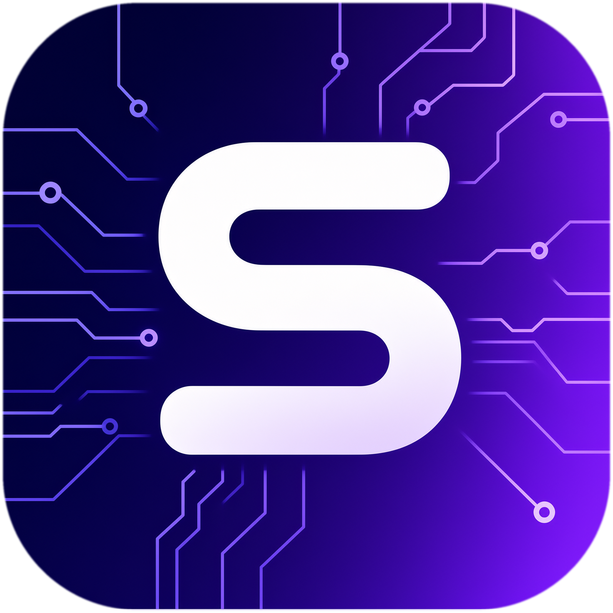

# Skcode

<div align="center">
  

**Open-source AI coding workbench: desktop app, web interface, terminal agent.**

English | [简体中文](README.md)

</div>

---

Skcode is an AI coding workbench: collaborate with an agent on coding tasks from the desktop app, your browser, or the terminal. **No account required** — bring your own model API key (BYOK) and start working; your code and data stay with you.

## Why Skcode

- **Multi-platform**: Electron desktop app, web interface, terminal TUI and CLI agent, all sharing one service and protocol stack.
- **Bring your own model (BYOK)**: no platform login needed — add your own model API key in settings; custom OpenAI-compatible providers supported.
- **2D pet system**: a 2D companion in the session area reacts to agent states (working, waiting for approval, asking questions, errors, done), with SilverKorali built in. Customize with your own pet packs, or let the AI create one for you.
- **Complete agent toolbox**: files, Git, terminal, embedded browser (Browser Use), web search & fetch, Node REPL, MCP, skills, hooks, subagents and dynamic workflows.
- **Remote & mobile**: run tasks on remote environments over SSH/WSL; control desktop sessions from your phone.
- **Plugin marketplace**: extend capabilities with community plugins. Task snapshots, Git checkpoints, scheduled and off-peak tasks included.

## Quick Start

You need Git, Node.js **24.14.0** and pnpm **10.33.2** (see [mise.toml](mise.toml)), then:

```bash
git clone <repo-url> && cd skcode
pnpm bootstrap      # install dependencies and build
pnpm dev:desktop    # launch the desktop app
```

After launch, open Settings → Models and add a model provider (paste your API key) to start chatting.

<details>
<summary><b>More development commands</b></summary>

| Command                        | Purpose                                         |
| ------------------------------ | ----------------------------------------------- |
| `pnpm dev:desktop`             | Desktop development (production endpoints)      |
| `pnpm dev:desktop:test`        | Desktop development (test endpoints)            |
| `pnpm dev:web`                 | Web dev with backend (default `localhost:5173`) |
| `pnpm bundle:desktop`          | Package the desktop app (`--os win/mac/linux`)  |
| `pnpm build:skcode`            | Build CLI release bundle (TUI / Web / Agent)    |
| `pnpm typecheck` / `pnpm lint` | Type check / lint                               |
| `pnpm verify:pre-push`         | Pre-push checks (lint + architecture)           |

The CLI release runs as `skcode`: no arguments starts the TUI, `skcode --web` starts the web UI; see `--help` for options.

</details>

## 2D Pet System

The 2D pet in the session corner reacts to agent states (working, permission requests, waiting for answers, errors, completion), with click interactions and random chatter. Everything is customizable:

- **Built-in**: SilverKorali (static art + breathing/motion video loops).
- **Custom pet packs**: drop art and a `pet.json` manifest into `~/.skcode/v2/pets/<pack-id>/`; enable it in Settings → General → Pet system.
- **AI creation**: click "Create with AI" in settings and the agent generates a complete pet pack (art, lines, motion) from a template.

See [specs/pet-system.md](specs/pet-system.md) for the pack format and acceptance scenarios.

## Repository Layout

| Directory                                             | Responsibility                                        |
| ----------------------------------------------------- | ----------------------------------------------------- |
| `packages/desktop`                                    | Electron main, host, renderer, desktop packaging      |
| `packages/web`, `packages/server`                     | Web client and HTTP / WebSocket services              |
| `packages/ui`, `packages/services`, `packages/shared` | Shared React components, services, protocols          |
| `apps/skcode-cli`                                     | Agent CLI, TUI, runtime and tools                     |
| `scripts`, `config`, `third-party`                    | Build scripts, built-in config, third-party materials |

## Configuration

Copy [.env.example](.env.example) to `.env` and adjust as needed (local overrides go in `.env.local`):

| Variable                  | Purpose                                            |
| ------------------------- | -------------------------------------------------- |
| `SKCODE_DATA_BASE_DIR`    | App data base directory (defaults to `~/.skcode/`) |
| `SKCODE_SERVER_WORKSPACE` | Workspace path for the web backend                 |
| `SKCODE_DIST_BASE_URL`    | Download root used by the install script           |

## Development

Behavior rules live in [specs/](specs/) — update the relevant spec before changing behavior. Code follows [AGENTS.md](AGENTS.md); UI follows [DESIGN.md](DESIGN.md). Run `pnpm verify:pre-push` before committing.

## License

First-party code in this repository is licensed under the [Apache License 2.0](LICENSE). Third-party software, fonts, icons and assets remain under their own terms — see [THIRD-PARTY-NOTICES.md](THIRD-PARTY-NOTICES.md) and [third-party/](third-party/).

AI-generated content and automated execution carry risks; read the [NOTICE.md](NOTICE.md) project statement before use.
